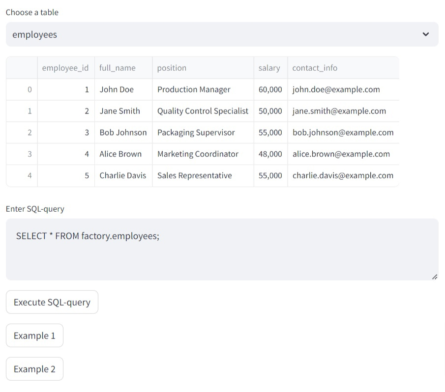

# Soap Factory Database Management
This project aims to provide a simple interface for managing a soap factory's database using Streamlit and PostgreSQL.

### Installation
1. Clone the repository:
```
git clone https://github.com/DikovAlexandr/SQL
cd SQL
```
2. Install the required packages:
```
pip install -r requirements.txt
```
3. Set up a virtual environment (optional but recommended):
```
python -m venv venv
source venv/bin/activate  # On Windows, use `venv\Scripts\activate`
```
4. Install required packages in the virtual environment:
```
pip install -r requirements.txt
```

### Usage
1. Configure your PostgreSQL database connection details in the code.
2. Initialize database for connection by running [executer](executer.py).
3. Run the Streamlit [app](app.py):
'''
streamlit run app.py
'''
3. Open your web browser and navigate to the provided local URL.
4. Select a table, execute SQL queries, and manage your soap factory database.


### Project Structure
- [executer](executer.py): Initialization of database from .sql file.
- [app.py](app.py): Main Streamlit app code.
- [database](database/): SQL scripts for creating the initial database schema.
- venv: Virtual environment (not included in the repository).

### License
This project is licensed under the [Apache 2.0 License](LICENSE).

